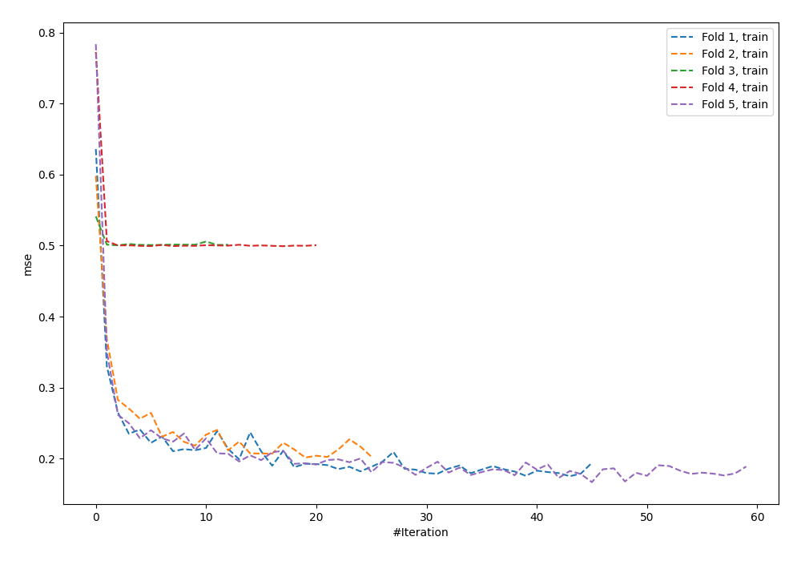
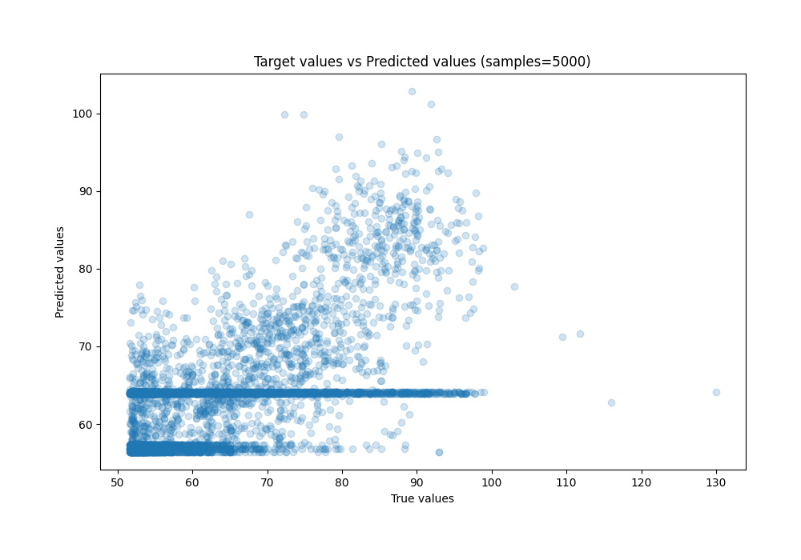
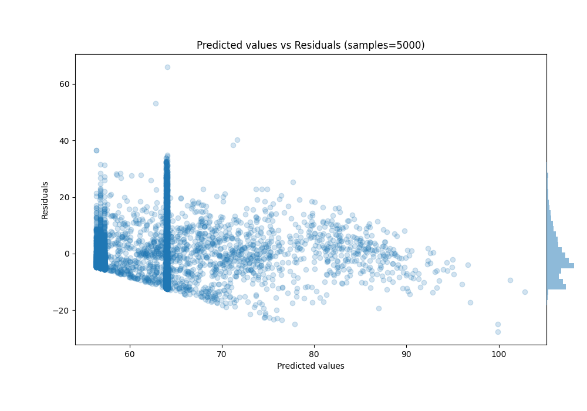

# Summary of 56_NeuralNetwork

[<< Go back](../README.md)

## Neural Network
- **n_jobs**: -1
- **dense_1_size**: 32
- **dense_2_size**: 4
- **learning_rate**: 0.1
- **explain_level**: 0

## Validation
 - **validation_type**: kfold
 - **shuffle**: True
 - **k_folds**: 5

## Optimized metric
rmse

## Training time

4.9 seconds

### Metric details:
| Metric   |     Score |
|:---------|----------:|
| MAE      |  7.35068  |
| MSE      | 92.3569   |
| RMSE     |  9.61025  |
| R2       |  0.354676 |
| MAPE     |  0.112814 |

## Learning curves

## True vs Predicted

## Predicted vs Residuals

[<< Go back](../README.md)
