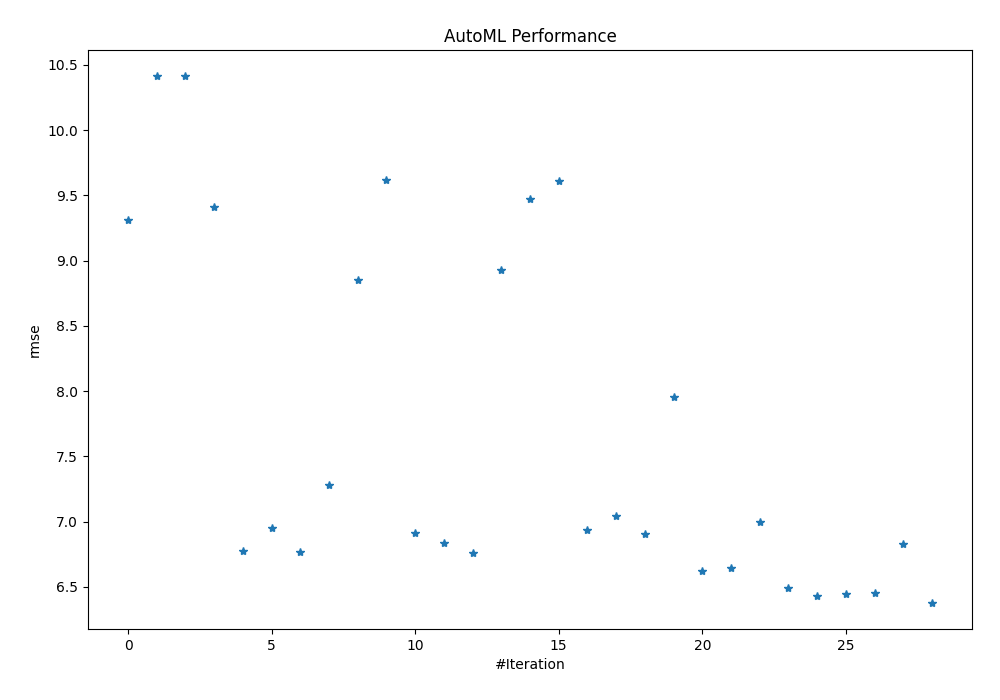
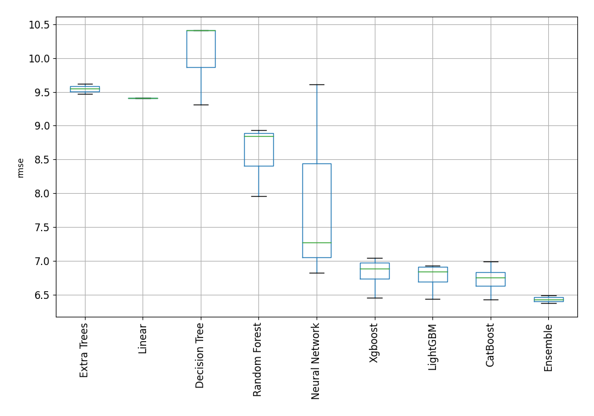
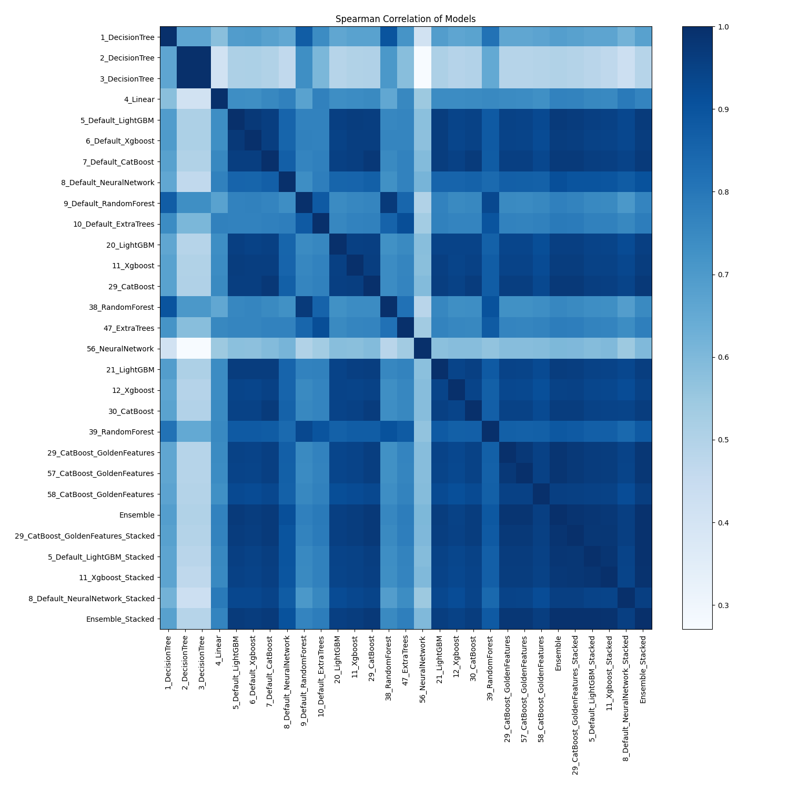

# AutoML Leaderboard

| Best model   | name                                                                               | model_type     | metric_type   |   metric_value |   train_time |
|:-------------|:-----------------------------------------------------------------------------------|:---------------|:--------------|---------------:|-------------:|
|              | [1_DecisionTree](1_DecisionTree/README.md)                                         | Decision Tree  | rmse          |        9.31206 |         2.8  |
|              | [2_DecisionTree](2_DecisionTree/README.md)                                         | Decision Tree  | rmse          |       10.4116  |         1.7  |
|              | [3_DecisionTree](3_DecisionTree/README.md)                                         | Decision Tree  | rmse          |       10.4116  |         1.87 |
|              | [4_Linear](4_Linear/README.md)                                                     | Linear         | rmse          |        9.40904 |         2.42 |
|              | [5_Default_LightGBM](5_Default_LightGBM/README.md)                                 | LightGBM       | rmse          |        6.77232 |         8.26 |
|              | [6_Default_Xgboost](6_Default_Xgboost/README.md)                                   | Xgboost        | rmse          |        6.94832 |         7.3  |
|              | [7_Default_CatBoost](7_Default_CatBoost/README.md)                                 | CatBoost       | rmse          |        6.76752 |        16.42 |
|              | [8_Default_NeuralNetwork](8_Default_NeuralNetwork/README.md)                       | Neural Network | rmse          |        7.27811 |         5.93 |
|              | [9_Default_RandomForest](9_Default_RandomForest/README.md)                         | Random Forest  | rmse          |        8.84995 |         7.99 |
|              | [10_Default_ExtraTrees](10_Default_ExtraTrees/README.md)                           | Extra Trees    | rmse          |        9.61916 |         6.2  |
|              | [20_LightGBM](20_LightGBM/README.md)                                               | LightGBM       | rmse          |        6.91013 |         7.13 |
|              | [11_Xgboost](11_Xgboost/README.md)                                                 | Xgboost        | rmse          |        6.83355 |         5.58 |
|              | [29_CatBoost](29_CatBoost/README.md)                                               | CatBoost       | rmse          |        6.75625 |        19.02 |
|              | [38_RandomForest](38_RandomForest/README.md)                                       | Random Forest  | rmse          |        8.93116 |        10.26 |
|              | [47_ExtraTrees](47_ExtraTrees/README.md)                                           | Extra Trees    | rmse          |        9.47224 |         6.28 |
|              | [56_NeuralNetwork](56_NeuralNetwork/README.md)                                     | Neural Network | rmse          |        9.61025 |         5.51 |
|              | [21_LightGBM](21_LightGBM/README.md)                                               | LightGBM       | rmse          |        6.93284 |         5.11 |
|              | [12_Xgboost](12_Xgboost/README.md)                                                 | Xgboost        | rmse          |        7.04285 |         4.62 |
|              | [30_CatBoost](30_CatBoost/README.md)                                               | CatBoost       | rmse          |        6.9061  |        10.54 |
|              | [39_RandomForest](39_RandomForest/README.md)                                       | Random Forest  | rmse          |        7.95808 |        10.13 |
|              | [29_CatBoost_GoldenFeatures](29_CatBoost_GoldenFeatures/README.md)                 | CatBoost       | rmse          |        6.62543 |        50.15 |
|              | [57_CatBoost_GoldenFeatures](57_CatBoost_GoldenFeatures/README.md)                 | CatBoost       | rmse          |        6.64265 |        30.55 |
|              | [58_CatBoost_GoldenFeatures](58_CatBoost_GoldenFeatures/README.md)                 | CatBoost       | rmse          |        6.99459 |        26.55 |
|              | [Ensemble](Ensemble/README.md)                                                     | Ensemble       | rmse          |        6.48932 |         1.46 |
|              | [29_CatBoost_GoldenFeatures_Stacked](29_CatBoost_GoldenFeatures_Stacked/README.md) | CatBoost       | rmse          |        6.43048 |        13.03 |
|              | [5_Default_LightGBM_Stacked](5_Default_LightGBM_Stacked/README.md)                 | LightGBM       | rmse          |        6.44265 |         5.39 |
|              | [11_Xgboost_Stacked](11_Xgboost_Stacked/README.md)                                 | Xgboost        | rmse          |        6.4527  |         4.92 |
|              | [8_Default_NeuralNetwork_Stacked](8_Default_NeuralNetwork_Stacked/README.md)       | Neural Network | rmse          |        6.82912 |         8.15 |
| **the best** | [Ensemble_Stacked](Ensemble_Stacked/README.md)                                     | Ensemble       | rmse          |        6.37972 |         2.6  |

### AutoML Performance

### AutoML Performance Boxplot

### Spearman Correlation of Models

