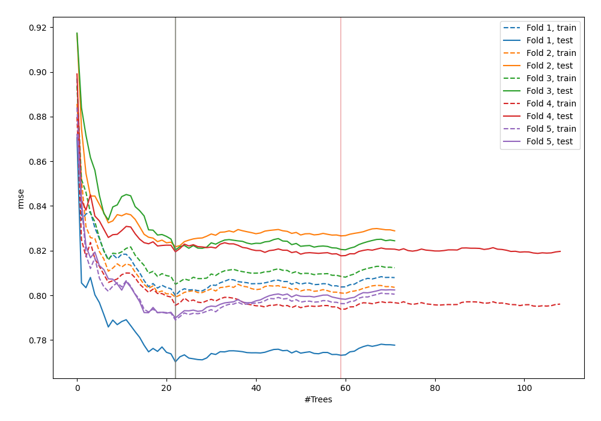
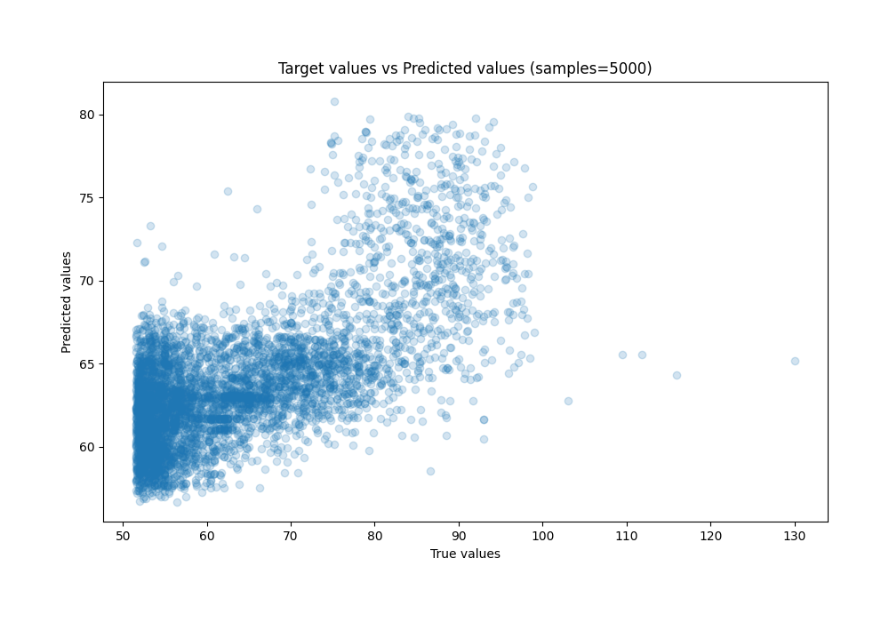
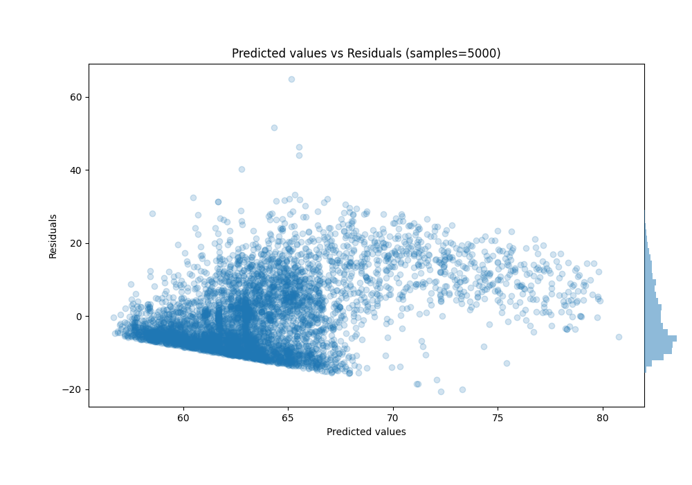

# Summary of 10_Default_ExtraTrees

[<< Go back](../README.md)

## Extra Trees Regressor (Extra Trees)
- **n_jobs**: -1
- **criterion**: squared_error
- **max_features**: 0.9
- **min_samples_split**: 30
- **max_depth**: 4
- **eval_metric_name**: rmse
- **explain_level**: 0

## Validation
 - **validation_type**: kfold
 - **shuffle**: True
 - **k_folds**: 5

## Optimized metric
rmse

## Training time

5.4 seconds

### Metric details:
| Metric   |     Score |
|:---------|----------:|
| MAE      |  7.83605  |
| MSE      | 92.5282   |
| RMSE     |  9.61916  |
| R2       |  0.353479 |
| MAPE     |  0.120598 |

## Learning curves

## True vs Predicted

## Predicted vs Residuals

[<< Go back](../README.md)
