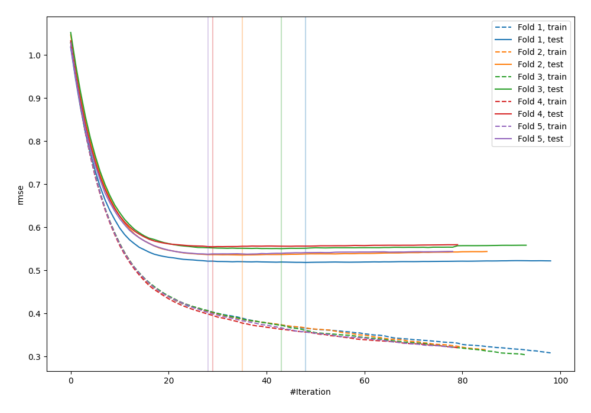
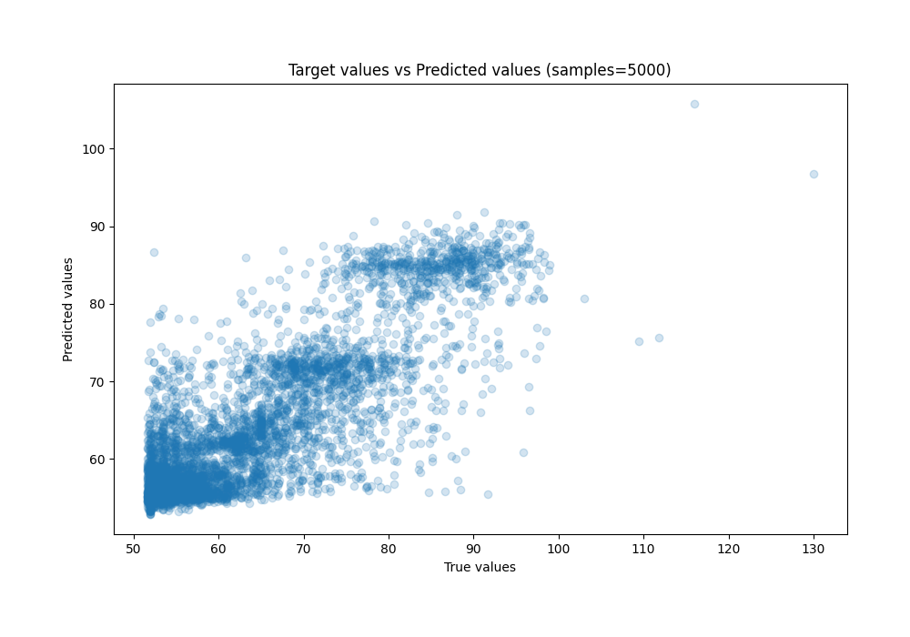
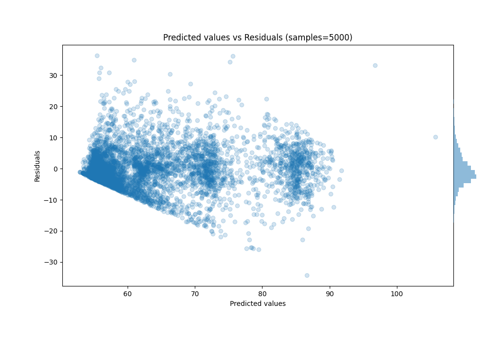

# Summary of 11_Xgboost_Stacked

[<< Go back](../README.md)

## Extreme Gradient Boosting (Xgboost)
- **n_jobs**: -1
- **objective**: reg:squarederror
- **eta**: 0.1
- **max_depth**: 7
- **min_child_weight**: 5
- **subsample**: 1.0
- **colsample_bytree**: 0.5
- **eval_metric**: rmse
- **explain_level**: 0

## Validation
 - **validation_type**: kfold
 - **shuffle**: True
 - **k_folds**: 5

## Optimized metric
rmse

## Training time

4.4 seconds

### Metric details:
| Metric   |      Score |
|:---------|-----------:|
| MAE      |  4.63644   |
| MSE      | 41.6373    |
| RMSE     |  6.4527    |
| R2       |  0.709068  |
| MAPE     |  0.0714666 |

## Learning curves

## True vs Predicted

## Predicted vs Residuals

[<< Go back](../README.md)
