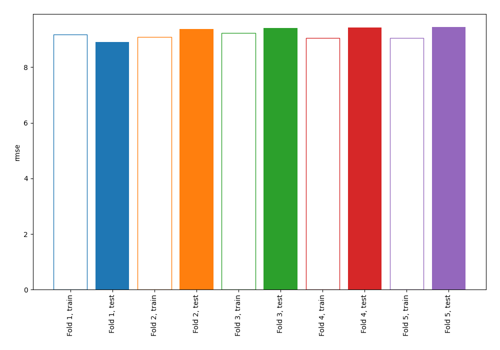
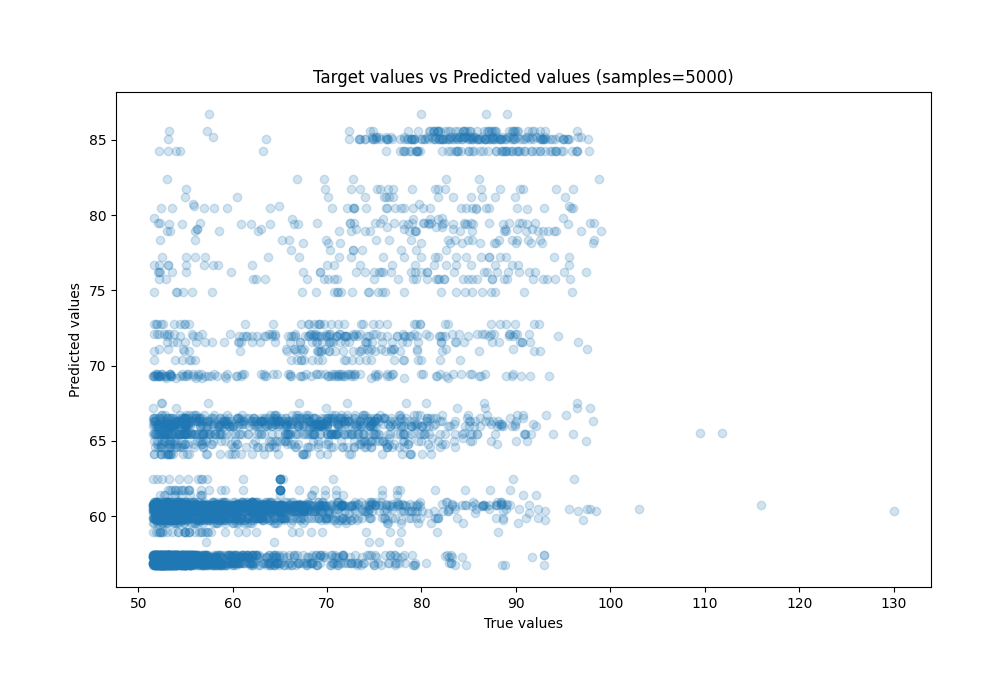
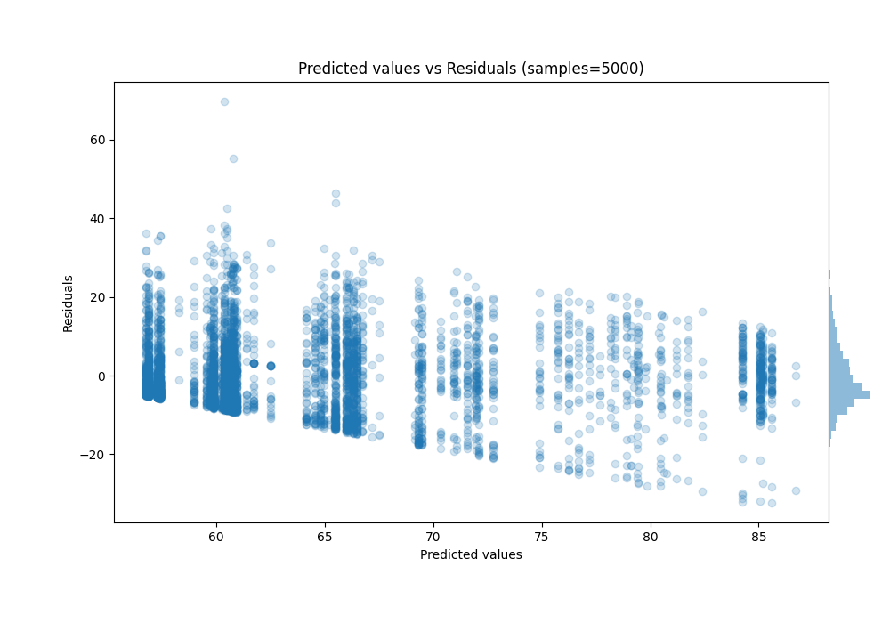

# Summary of 1_DecisionTree

[<< Go back](../README.md)

## Decision Tree
- **n_jobs**: -1
- **criterion**: friedman_mse
- **max_depth**: 4
- **explain_level**: 0

## Validation
 - **validation_type**: kfold
 - **shuffle**: True
 - **k_folds**: 5

## Optimized metric
rmse

## Training time

1.9 seconds

### Metric details:
| Metric   |     Score |
|:---------|----------:|
| MAE      |  7.03299  |
| MSE      | 86.7144   |
| RMSE     |  9.31206  |
| R2       |  0.394102 |
| MAPE     |  0.108575 |

## Learning curves

## True vs Predicted

## Predicted vs Residuals

[<< Go back](../README.md)
