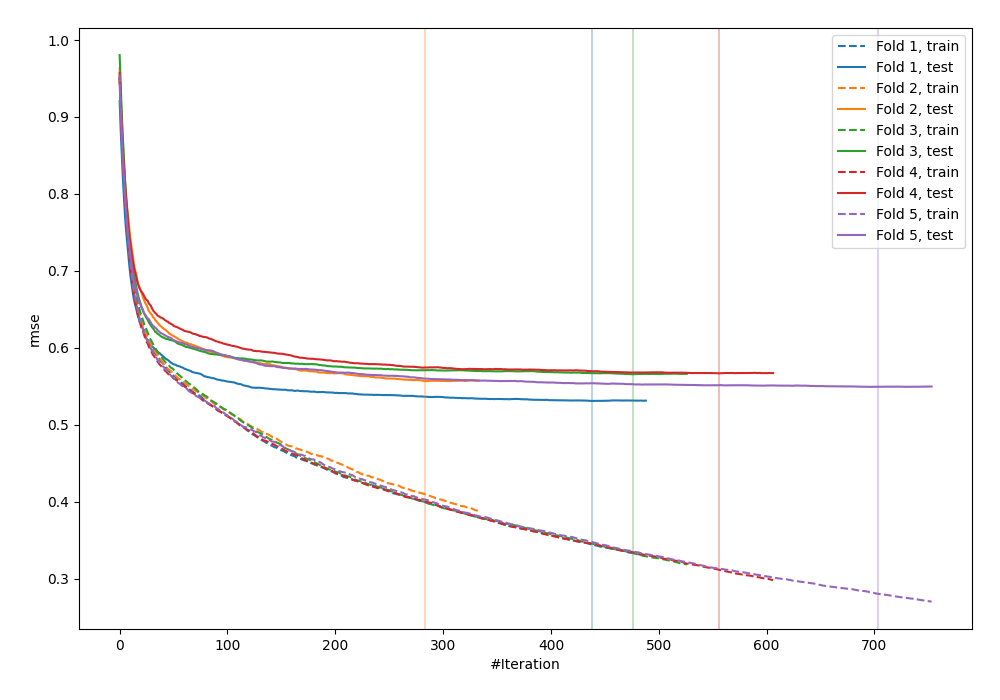
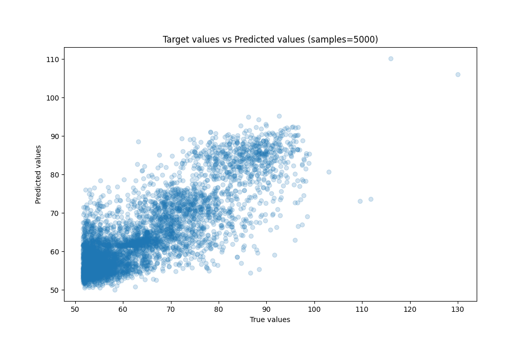
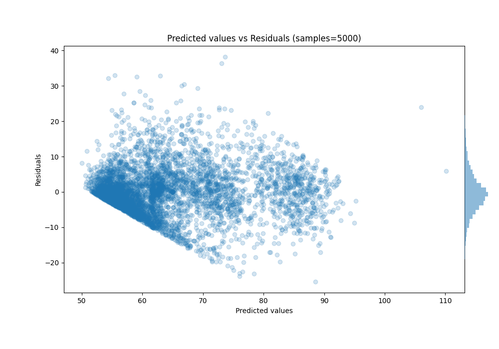

# Summary of 29_CatBoost_GoldenFeatures

[<< Go back](../README.md)

## CatBoost
- **n_jobs**: -1
- **learning_rate**: 0.1
- **depth**: 7
- **rsm**: 0.8
- **loss_function**: RMSE
- **eval_metric**: RMSE
- **explain_level**: 0

## Validation
 - **validation_type**: kfold
 - **shuffle**: True
 - **k_folds**: 5

## Optimized metric
rmse

## Training time

49.5 seconds

### Metric details:
| Metric   |      Score |
|:---------|-----------:|
| MAE      |  4.81272   |
| MSE      | 43.8964    |
| RMSE     |  6.62543   |
| R2       |  0.693284  |
| MAPE     |  0.0741684 |

## Learning curves

## True vs Predicted

## Predicted vs Residuals

[<< Go back](../README.md)
