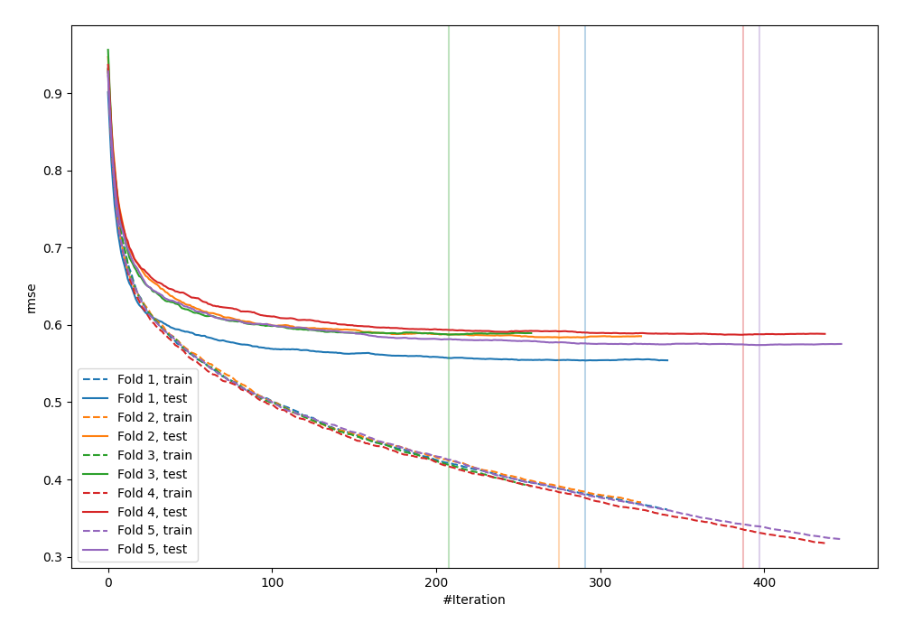
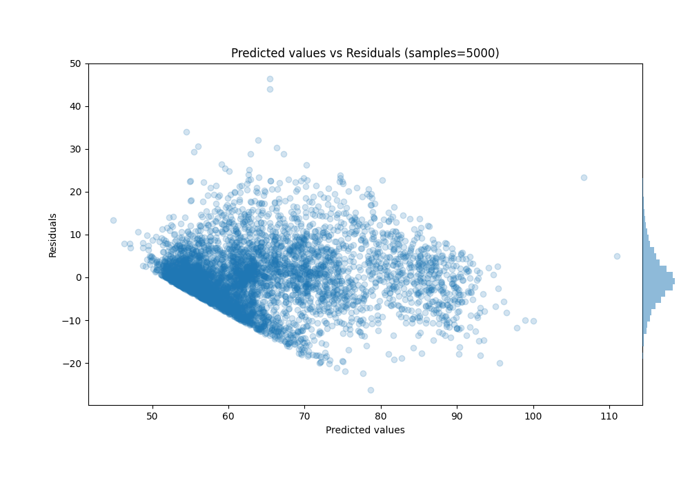

# Summary of 30_CatBoost

[<< Go back](../README.md)

## CatBoost
- **n_jobs**: -1
- **learning_rate**: 0.2
- **depth**: 6
- **rsm**: 0.8
- **loss_function**: RMSE
- **eval_metric**: RMSE
- **explain_level**: 0

## Validation
 - **validation_type**: kfold
 - **shuffle**: True
 - **k_folds**: 5

## Optimized metric
rmse

## Training time

9.9 seconds

### Metric details:
| Metric   |      Score |
|:---------|-----------:|
| MAE      |  5.07241   |
| MSE      | 47.6942    |
| RMSE     |  6.9061    |
| R2       |  0.666747  |
| MAPE     |  0.0781891 |

## Learning curves

## True vs Predicted

## Predicted vs Residuals

[<< Go back](../README.md)
