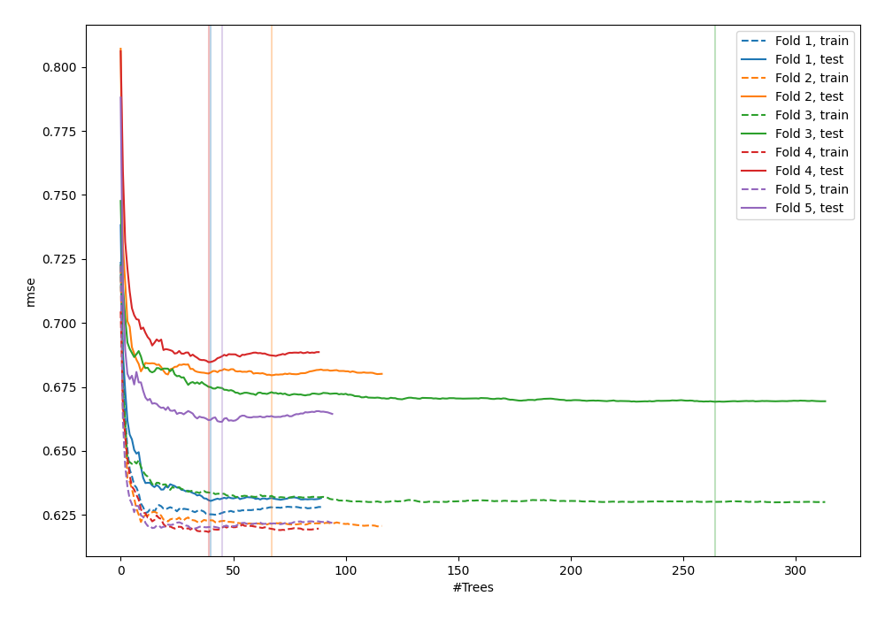
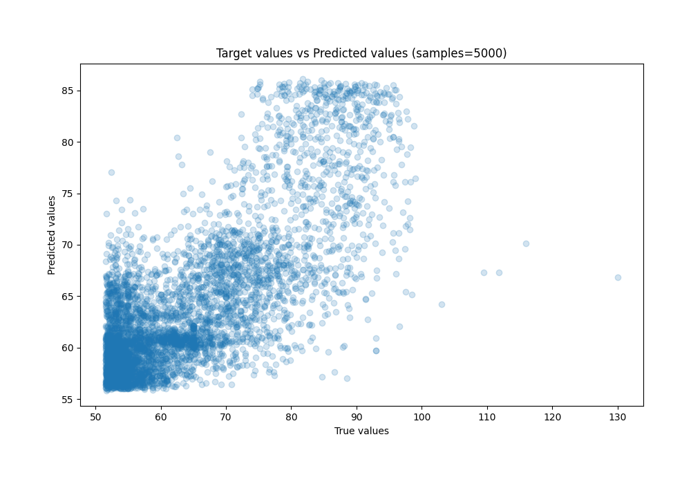
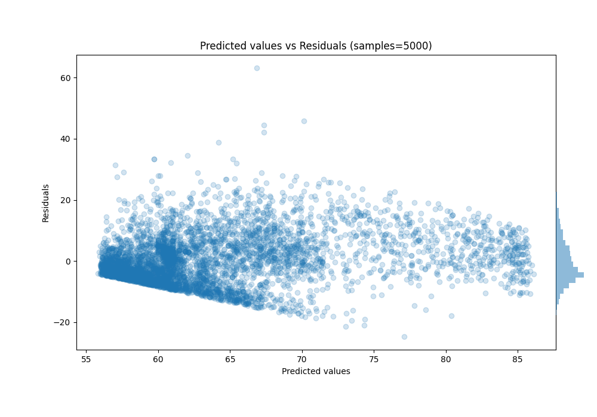

# Summary of 39_RandomForest

[<< Go back](../README.md)

## Random Forest
- **n_jobs**: -1
- **criterion**: squared_error
- **max_features**: 0.5
- **min_samples_split**: 30
- **max_depth**: 6
- **eval_metric_name**: rmse
- **explain_level**: 0

## Validation
 - **validation_type**: kfold
 - **shuffle**: True
 - **k_folds**: 5

## Optimized metric
rmse

## Training time

9.5 seconds

### Metric details:
| Metric   |      Score |
|:---------|-----------:|
| MAE      |  6.17891   |
| MSE      | 63.331     |
| RMSE     |  7.95808   |
| R2       |  0.557488  |
| MAPE     |  0.0954631 |

## Learning curves

## True vs Predicted

## Predicted vs Residuals

[<< Go back](../README.md)
