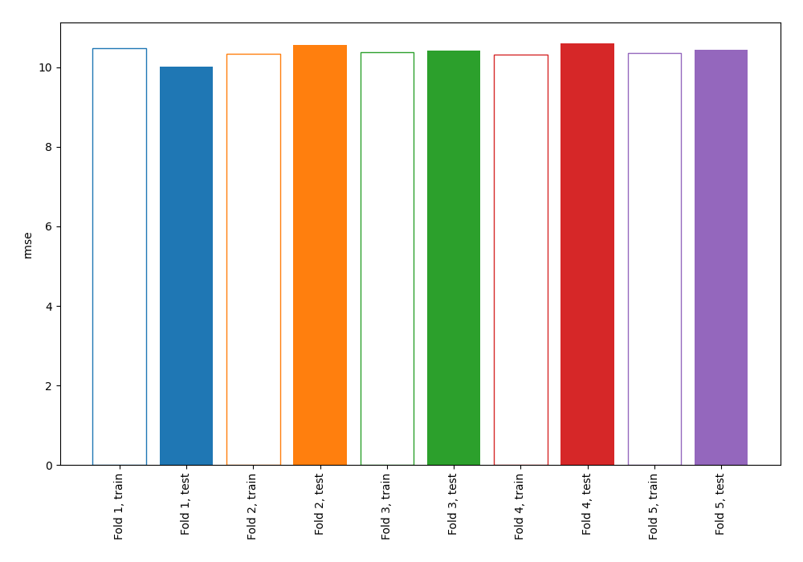
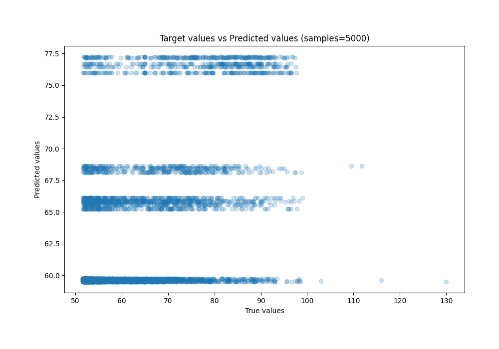
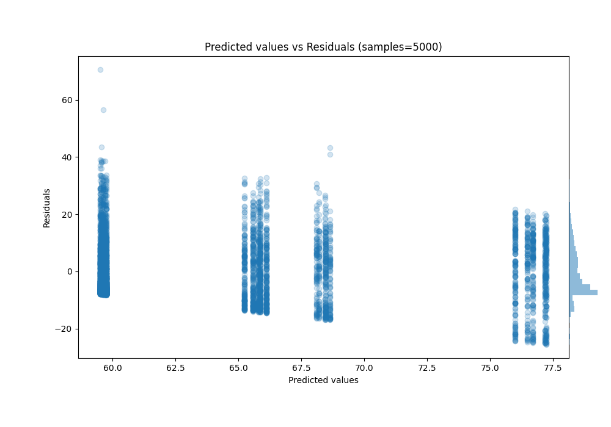

# Summary of 3_DecisionTree

[<< Go back](../README.md)

## Decision Tree
- **n_jobs**: -1
- **criterion**: squared_error
- **max_depth**: 2
- **explain_level**: 0

## Validation
 - **validation_type**: kfold
 - **shuffle**: True
 - **k_folds**: 5

## Optimized metric
rmse

## Training time

1.2 seconds

### Metric details:
| Metric   |      Score |
|:---------|-----------:|
| MAE      |   8.17691  |
| MSE      | 108.402    |
| RMSE     |  10.4116   |
| R2       |   0.242567 |
| MAPE     |   0.125588 |

## Learning curves

## True vs Predicted

## Predicted vs Residuals

[<< Go back](../README.md)
