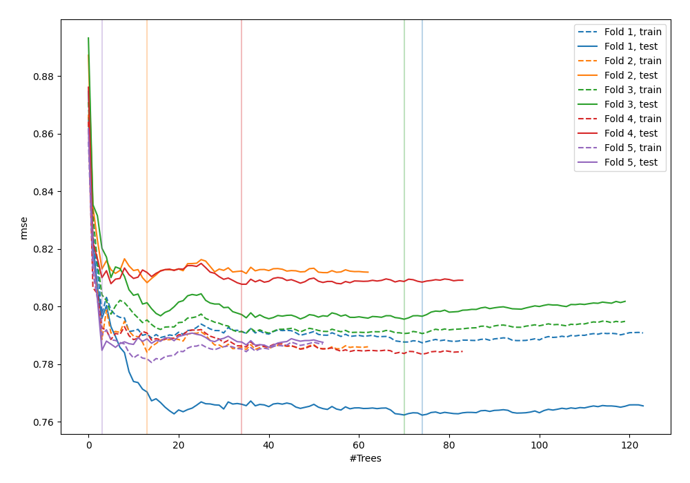
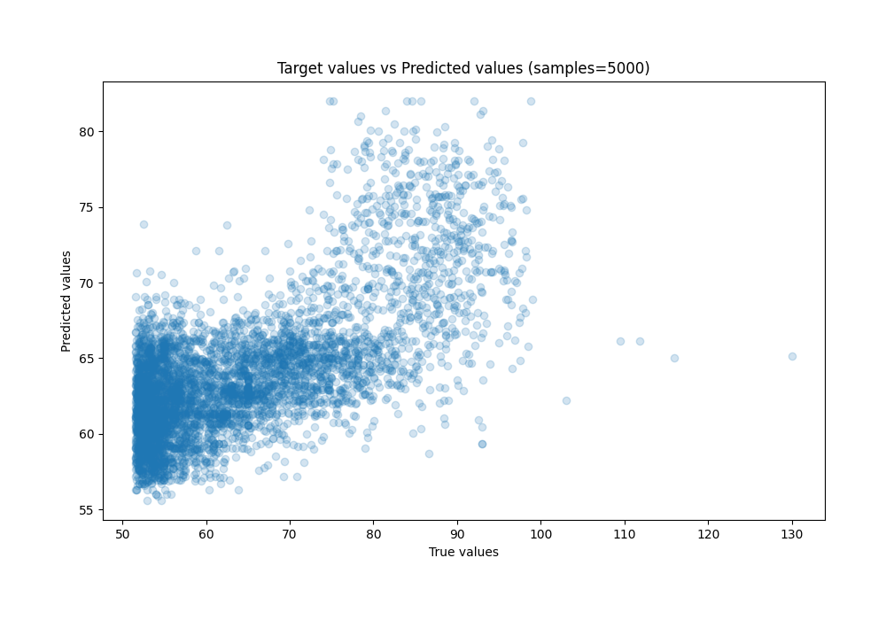
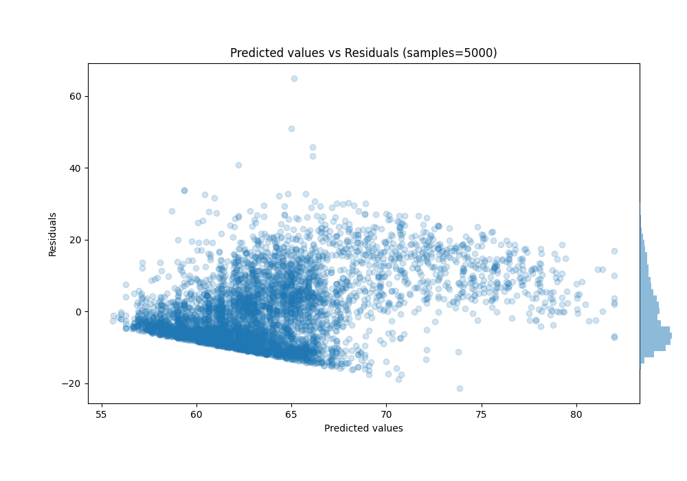

# Summary of 47_ExtraTrees

[<< Go back](../README.md)

## Extra Trees Regressor (Extra Trees)
- **n_jobs**: -1
- **criterion**: squared_error
- **max_features**: 1.0
- **min_samples_split**: 40
- **max_depth**: 4
- **eval_metric_name**: rmse
- **explain_level**: 0

## Validation
 - **validation_type**: kfold
 - **shuffle**: True
 - **k_folds**: 5

## Optimized metric
rmse

## Training time

5.6 seconds

### Metric details:
| Metric   |     Score |
|:---------|----------:|
| MAE      |  7.68485  |
| MSE      | 89.7233   |
| RMSE     |  9.47224  |
| R2       |  0.373078 |
| MAPE     |  0.118357 |

## Learning curves

## True vs Predicted

## Predicted vs Residuals

[<< Go back](../README.md)
