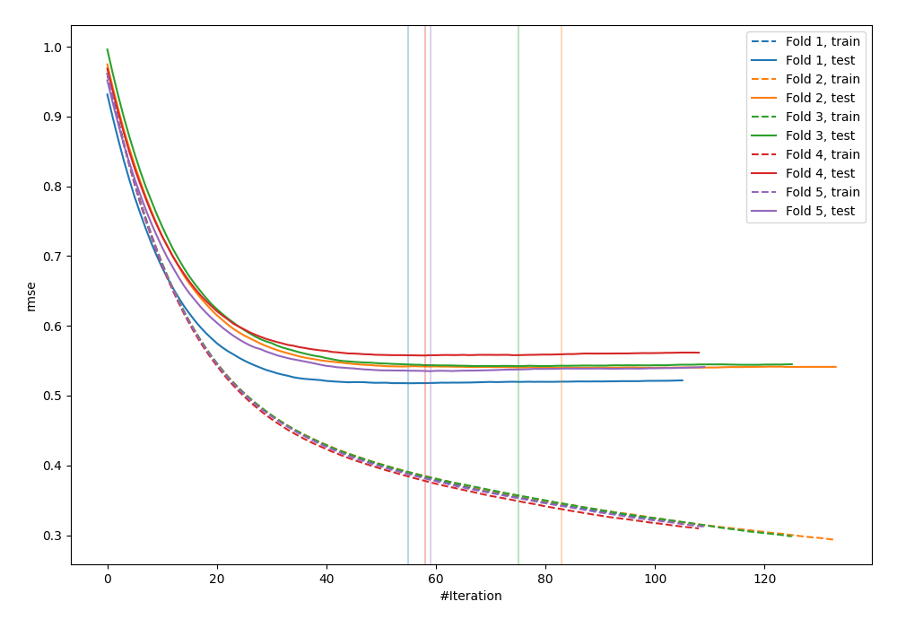
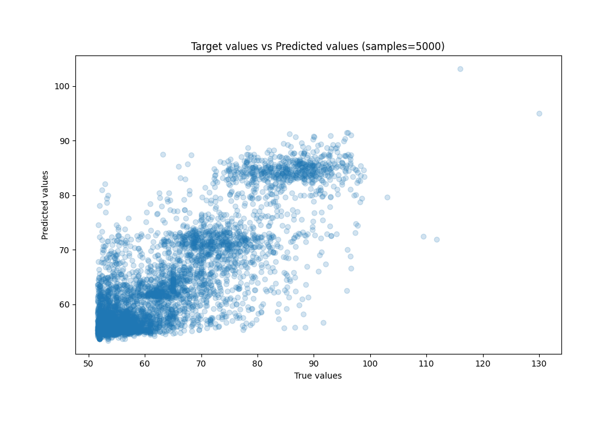
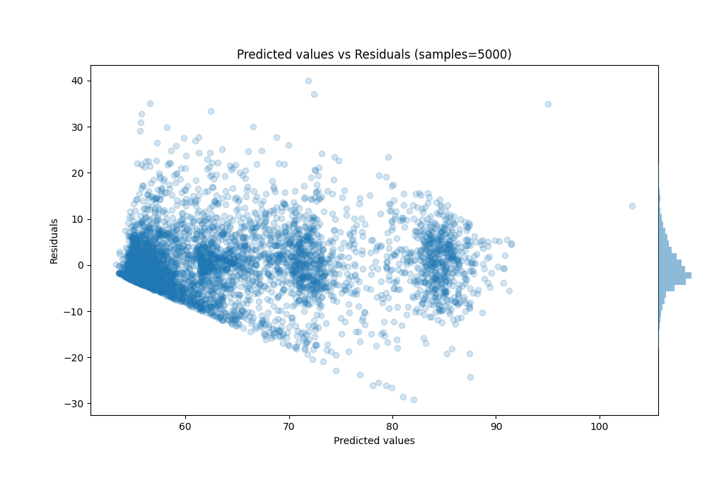

# Summary of 5_Default_LightGBM_Stacked

[<< Go back](../README.md)

## LightGBM
- **n_jobs**: -1
- **objective**: regression
- **num_leaves**: 63
- **learning_rate**: 0.05
- **feature_fraction**: 0.9
- **bagging_fraction**: 0.9
- **min_data_in_leaf**: 10
- **metric**: rmse
- **custom_eval_metric_name**: None
- **explain_level**: 0

## Validation
 - **validation_type**: kfold
 - **shuffle**: True
 - **k_folds**: 5

## Optimized metric
rmse

## Training time

4.8 seconds

### Metric details:
| Metric   |      Score |
|:---------|-----------:|
| MAE      |  4.62327   |
| MSE      | 41.5078    |
| RMSE     |  6.44265   |
| R2       |  0.709974  |
| MAPE     |  0.0710619 |

## Learning curves

## True vs Predicted

## Predicted vs Residuals

[<< Go back](../README.md)
