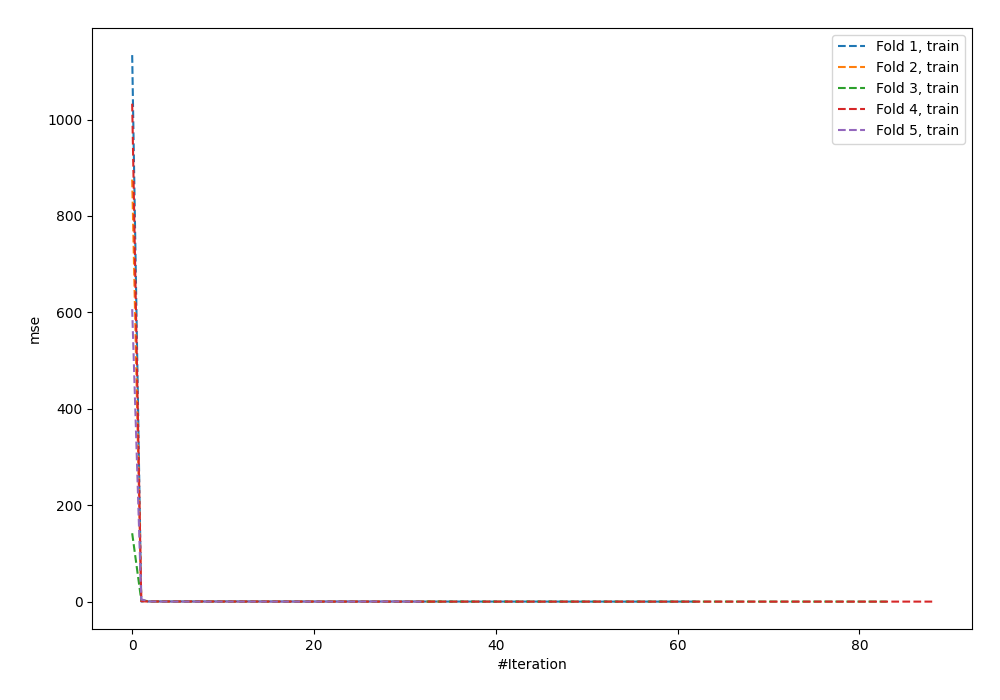
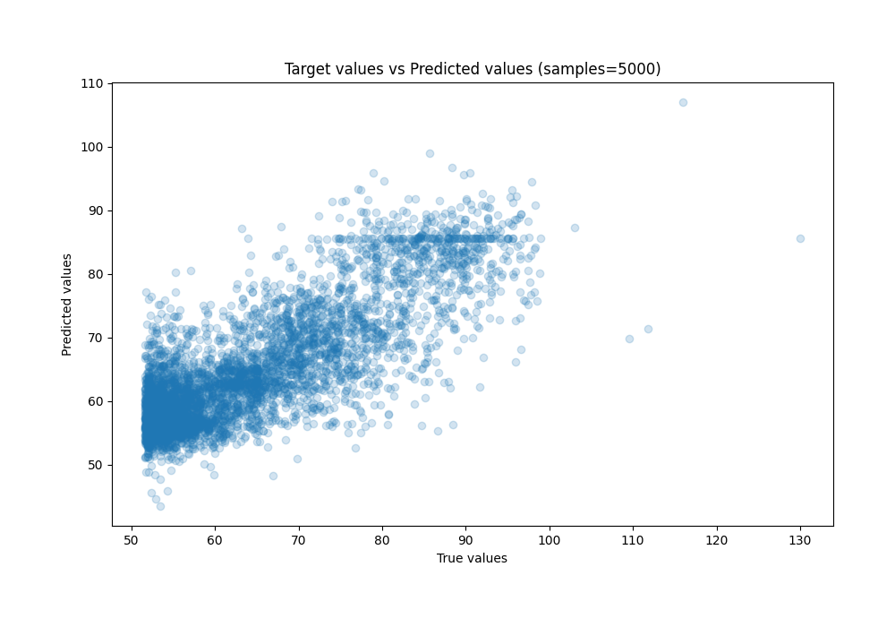
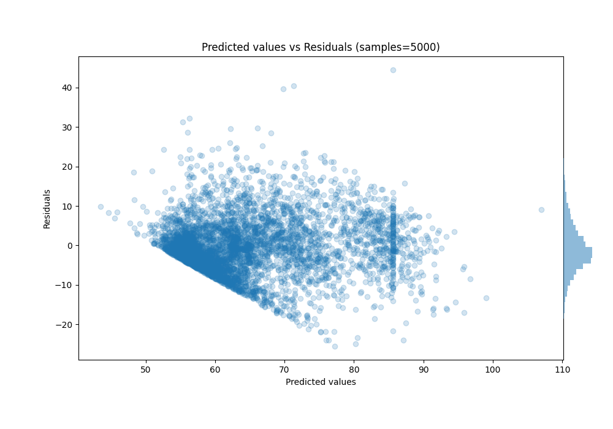

# Summary of 8_Default_NeuralNetwork_Stacked

[<< Go back](../README.md)

## Neural Network
- **n_jobs**: -1
- **dense_1_size**: 32
- **dense_2_size**: 16
- **learning_rate**: 0.05
- **explain_level**: 0

## Validation
 - **validation_type**: kfold
 - **shuffle**: True
 - **k_folds**: 5

## Optimized metric
rmse

## Training time

7.5 seconds

### Metric details:
| Metric   |      Score |
|:---------|-----------:|
| MAE      |  5.14686   |
| MSE      | 46.6369    |
| RMSE     |  6.82912   |
| R2       |  0.674135  |
| MAPE     |  0.0801897 |

## Learning curves

## True vs Predicted

## Predicted vs Residuals

[<< Go back](../README.md)
