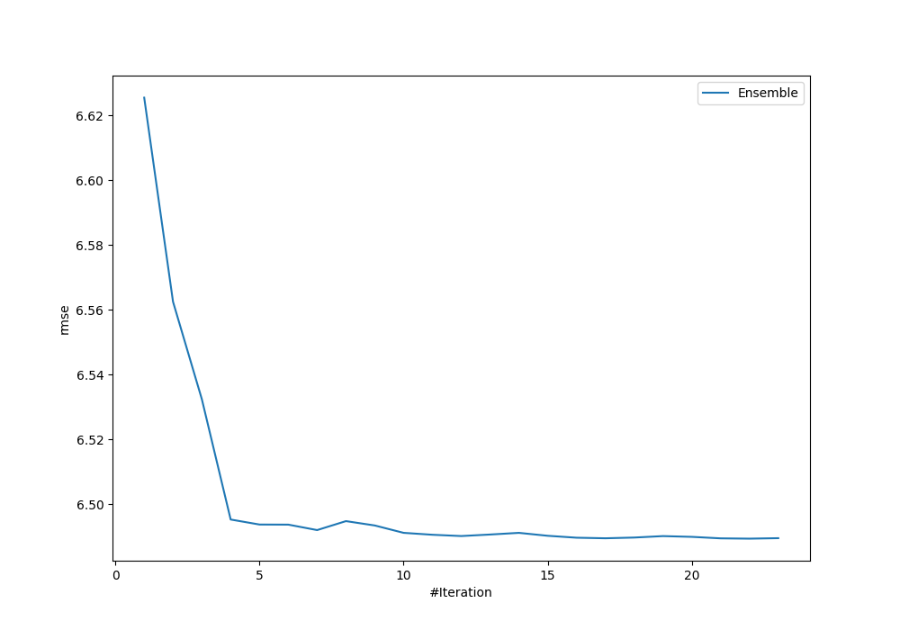
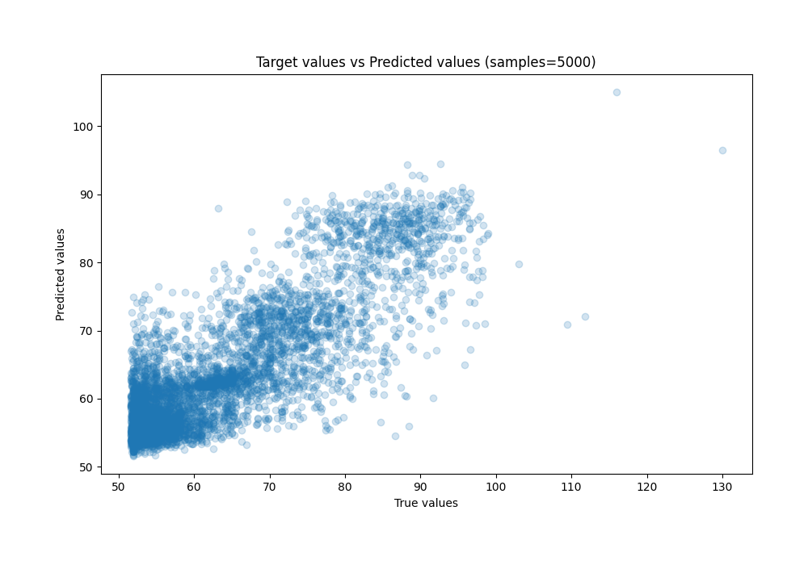
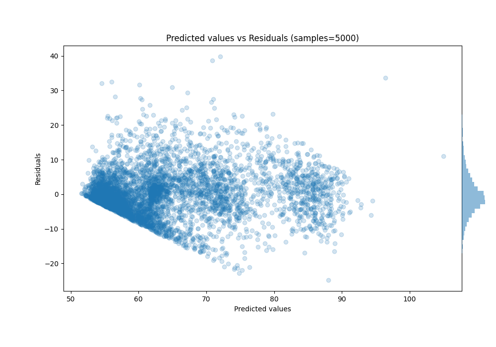

# Summary of Ensemble

[<< Go back](../README.md)

## Ensemble structure
| Model                      |   Weight |
|:---------------------------|---------:|
| 29_CatBoost                |        1 |
| 29_CatBoost_GoldenFeatures |        6 |
| 57_CatBoost_GoldenFeatures |        6 |
| 5_Default_LightGBM         |        5 |
| 8_Default_NeuralNetwork    |        4 |

### Metric details:
| Metric   |      Score |
|:---------|-----------:|
| MAE      |  4.7426    |
| MSE      | 42.1112    |
| RMSE     |  6.48932   |
| R2       |  0.705757  |
| MAPE     |  0.0729064 |

## Learning curves

## True vs Predicted

## Predicted vs Residuals

[<< Go back](../README.md)
