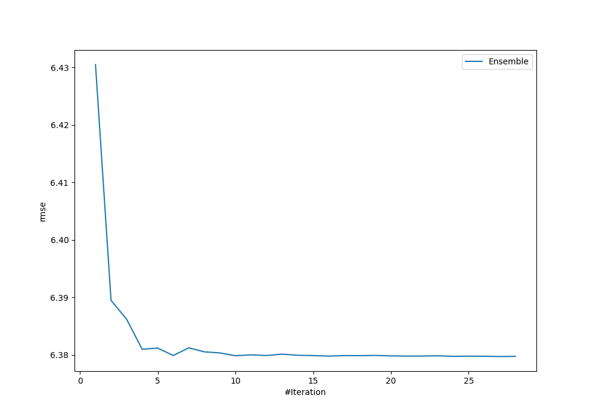
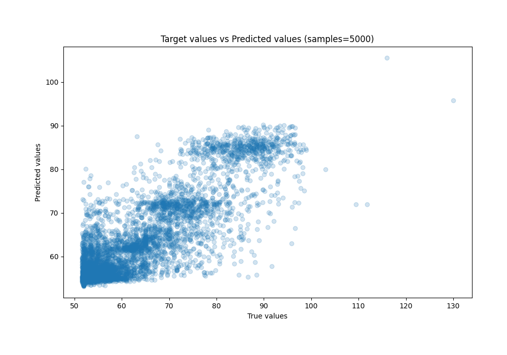
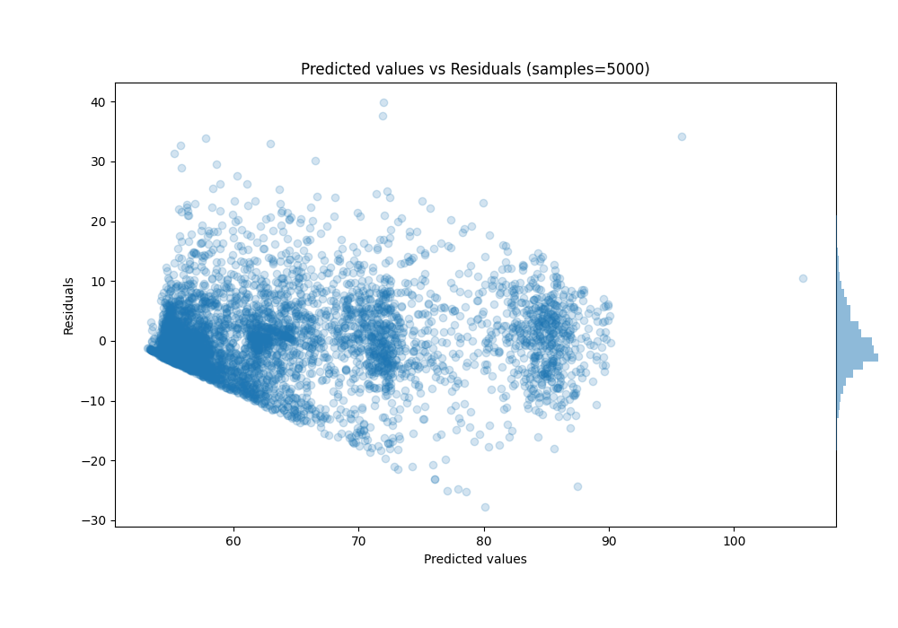

# Summary of Ensemble_Stacked

[<< Go back](../README.md)

## Ensemble structure
| Model                              |   Weight |
|:-----------------------------------|---------:|
| 11_Xgboost_Stacked                 |        5 |
| 29_CatBoost_GoldenFeatures         |        1 |
| 29_CatBoost_GoldenFeatures_Stacked |        8 |
| 5_Default_LightGBM_Stacked         |        9 |
| Ensemble                           |        4 |

### Metric details:
| Metric   |      Score |
|:---------|-----------:|
| MAE      |  4.59878   |
| MSE      | 40.7008    |
| RMSE     |  6.37972   |
| R2       |  0.715612  |
| MAPE     |  0.0707334 |

## Learning curves

## True vs Predicted

## Predicted vs Residuals

[<< Go back](../README.md)
